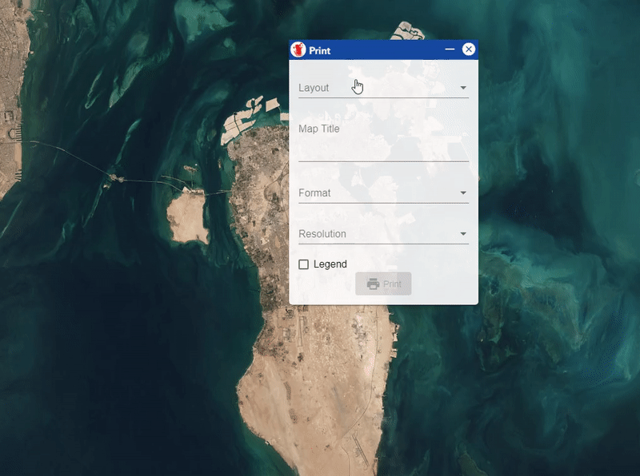

# Angular Draggable Widget

angular-draggable-component is a tiny library to add multible draggable widgets to your angular application.



## Installation

To use with node:

```console
npm install angular-draggable-widget
```

## Usage

Import `AngularDraggableWidgetModule` in your `AppModule`

```typescript
import { AngularDraggableWidgetModule } from 'angular-draggable-widget';

@NgModule({
  declarations: [AppComponent],
  imports: [
      BrowserModule,
      AngularDraggableWidgetModule
   ],
  providers: [],
  bootstrap: [AppComponent],
})
export class AppModule {}
```

and then in `html` template

```html
<draggable-widget
   [isOpened]="true"
   [isDraggable]="true"
   [isMinimizable]="false"
   title="my widget title"
   xPosition="25px"
   yPosition="50px"
   [zIndex]="2"
   iconImageSrc="../assets/logo.png">
    Add your widget content here
  </draggable-widget>
```